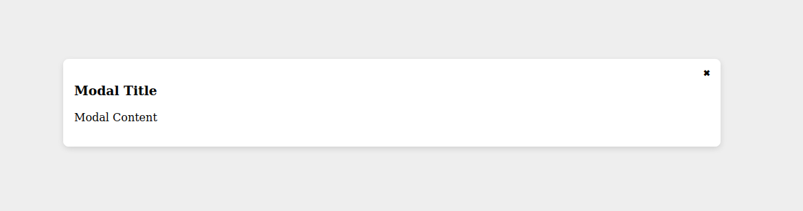
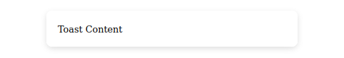

# ui-mod

> React components for fast prototyping

## Setup
`npm i @ui-mod/ui-mod`

## Components
### Container
Import Container
```jsx
import { Container } from "@ui-mod/ui-mod";
```

Define and use
```jsx
<Container>...</Container>
```

### Cover
```jsx
import { Cover } from "@ui-mod/ui-mod";
```

Define and use
```jsx
<Cover>...</Cover>
```

### Modal
Import modal
```jsx
import { Modal } from "@ui-mod/ui-mod";
```

Define state
```jsx
const [modal, setModal] = useState(null);
```

Define Element
```jsx
<Modal state={{ modal, setModal }} />
```

Set modal content
```js
setModal(<>
    <h3>Modal Title</h3>
    <p>Modal Content</p>
</>);
```
Clear the modal manually
```js
setModal(null);
```


### Toast
Import toast
```jsx
import { Toast } from "@ui-mod/ui-mod";
```

Define state
```jsx
const [toast, setToast] = useState(null);
```

Define Element
```jsx
<Toast state={{ toast, setToast }} />
```

Show a toast
```js
setToast("This is my toast")
```



## For Contributers
- To build and link library
    - `npm run build`
    - `npm link`
- To use in sample project 
    - `npm link ui-mod`
- To publish
    - `npm publish --access=public`